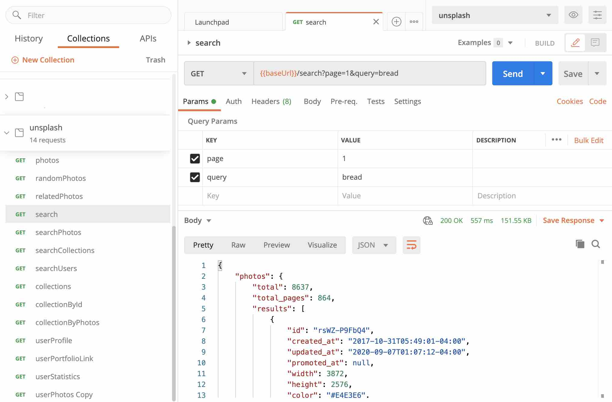
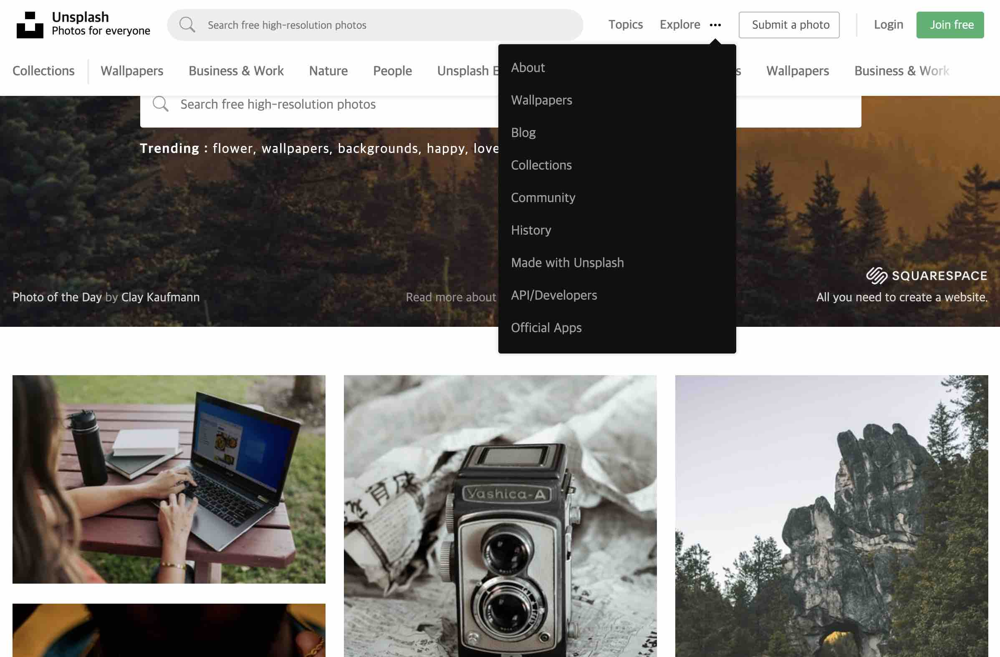
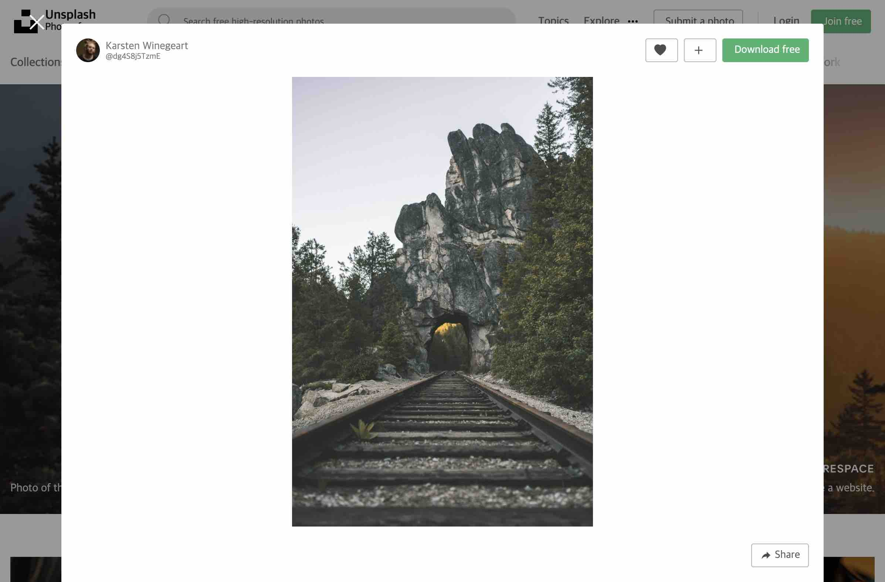
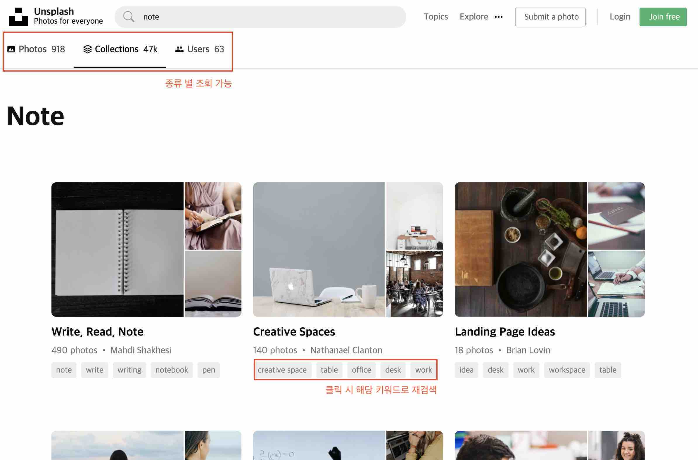
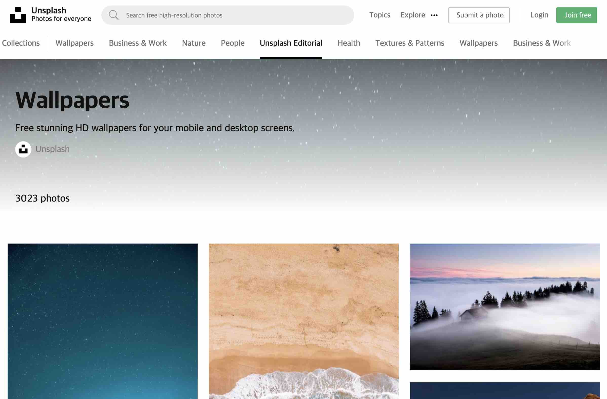

## 무료 사진 소스 제공 사이트 Unsplash 카피 (ver_2)

👀 [[Unsplash dev api]](https://unsplash.com/developers)

**[Stack]**
- Unsplash에서 제공되는 dev api
- Redux, Saga, Axios
- React, React-router-dom, Styled-components
- React, Redux Hook 사용

**[Gained]**
- 기존 copy-unsplash를 구현하면서 아쉬웠던 부분 보완 (하기)
- git commit 세분화, git issue 활용 
- 디렉토리 구조 개선, 보다 재사용성을 높인 컴포넌트 구조
- 환경 변수 사용, Styled-components 적극 활용 
- store를 나누어 사용 (bindActionCreators, combineReducers...)
- 기존 사용한 HOC이 아닌 Hook으로 구현
- CreatePortal 사용하여 모달 구현, 더블 스크롤 방지 추가
- Masonry lib사용, InfiniteScroll self구현
- RWD (Responsive web design), flex 사용
- ux에 대한 고민

**[Structure]**

```
    |____src
    | |____api
    | | |____index.js
    | |____redux
    | | |____app
    | | | |____redux.js
    | | | |____saga.js
    | | |____store.js
    | | |____actionCreators.js
    | | |____sagas.js
    | | |____reducers.js
    | | |____photos
    | | | |____redux.js
    | | | |____saga.js
    | |____helpers
    | | |____HistoryHelper.js
    | | |____TokenHelper.js
    | | |____CommonHelper.js
    
    | |____mock
    | | |____mock.js
    | |____index.js
    
    | |____components
    | | |____SearchBar
    | | | |____index.js
    | | | |____SearchBar.js
    | | |____InfiniteScroll
    | | | |____InfiniteScroll.js
    | | |____Card
    | | | |____index.js
    | | | |____CardWrapper.js
    | | | |____ModalDetail.js
    | | | |____Card.js=
    | | |____Modal
    | | | |____ModalPortal.js
    | | | |____index.js
    | | | |____Modal.js
    | | |____ . . . .
    
    | |____views
    | | |____pages
    | | | |____home
    | | | | |____index.js
    | | | | |____components
    | | | | | |____MainCover.js
    | | |____ . . . . 
    
    | |____assets
    | | |____scss
    | | | |____style.scss
    | | | |____base
    | | | | |_____reset.scss
    | | | | |_____common.scss
    | | | | |_____color.scss
    | | |____image
    | | | |____index.js
    | | | |____user-icon.jpg
    | | | |____. . . .
    
    | |____Routes.js
    | |____App.js
```  


**[Postman 활용]**


---

**[구현한 Pages]** 

Main, PhotoDetail, Search, Collection

### ✨ Main
---




### ✨ PhotoDetail
---



### ✨ Search
---


### ✨ Search Result
---


### ✨ Collections
---


